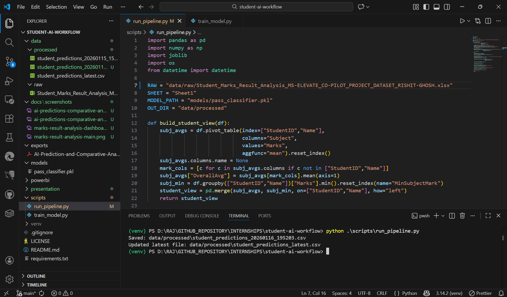
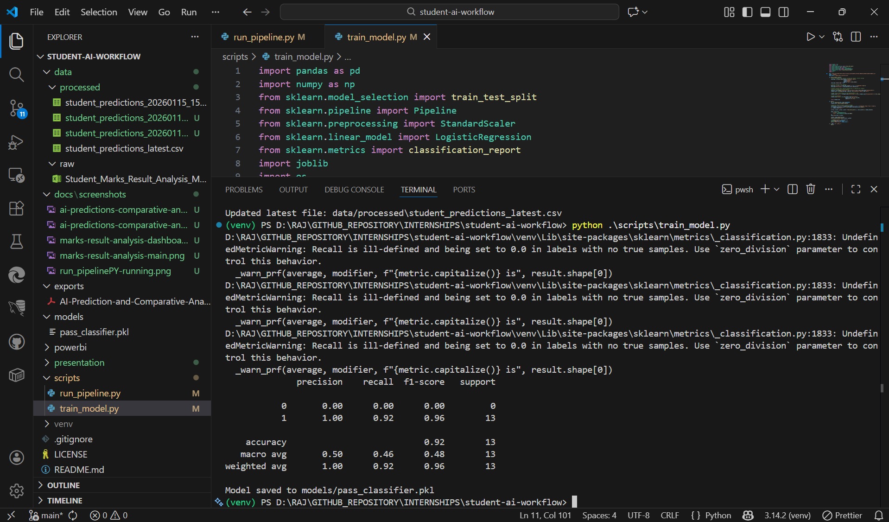
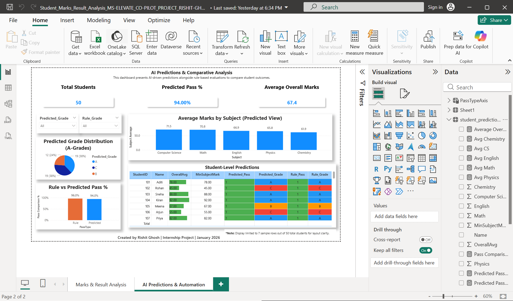
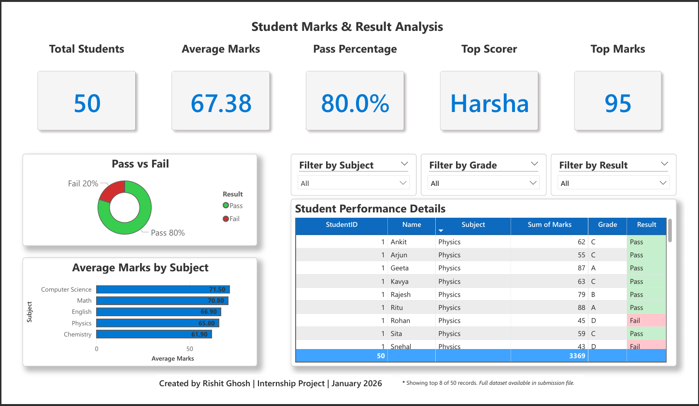
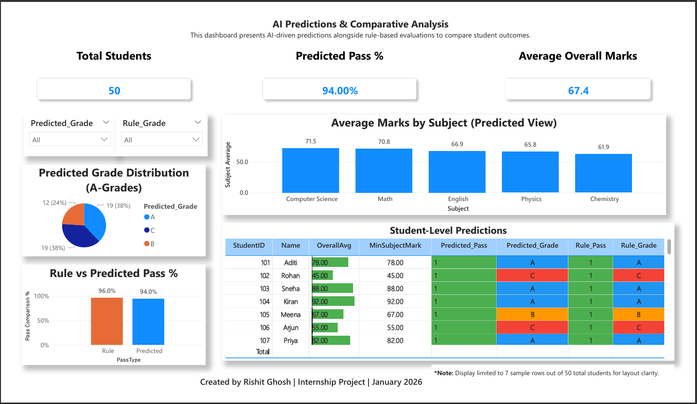

# Student AI Workflow

## Overview
This project is part of the **Microsoft Elevate Internship (December 2025 Batch)**.  
It extends a Power BI student marks dashboard into an **AI-powered workflow** using Python, Copilot, and Power Automate.  
The goal is to automate student performance analysis, generate predictions, and deliver insights through a modular, reproducible pipeline.

---

## Features
- Power BI dashboard with KPIs, grade distribution, and subject averages
- Student marks dataset (Excel) for rule-based and predictive analysis
- Python ML pipeline (scikit-learn) for pass/fail and grade prediction
- Copilot-generated insights and conditional formatting logic
- Power Automate workflow for automated reporting and refresh
- Organized folder structure for reproducibility and clarity

---

## Tech Stack
- **Python** (**required*) → [Download](https://www.python.org/downloads/)  
  Libraries: `pandas`, `scikit-learn`, `joblib`, `openpyxl`
- **Power BI Desktop** (**required*) → [Download](https://www.microsoft.com/en-us/power-platform/products/power-bi/downloads)  

### Future Extensions (Optional)
- **Microsoft Power Automate** → Can be added by users for workflow automation/reporting
- **Microsoft Copilot** → Can be integrated via Copilot Studio to build AI agents

---

## Screenshots

### 🔹 Run Pipeline [1st]


### 🔹 Train Model [2nd]


### 🔹 Marks & Result Analysis Dashboard [3rd]


### 🔹 AI Prediction & Comparative Analysis Dashboard [4th]


### 🔹 Marks & Result Analysis [5th]


### 🔹 AI Prediction & Comparative Analysis [6th]


---

> To view the main project file: [Click here](powerbi/Student_Marks_Result_Analysis_MS-ELEVATE_CO-PILOT_PROJECT_RISHIT-GHOSH.pbix) 
>> NOTE: This file requries an compatible app for opening. Refer **[Tech Stack](#tech-stack)** for more information.

----

## Project Structure
```
student-ai-workflow/
├─ data/
│   ├─ raw/
│   │   └─ Student_Marks_Result_Analysis_MS-ELEVATE_CO-PILOT_PROJECT_DATASET_RISHIT-GHOSH.xlsx
│   └─ processed/
│       ├─ student_predictions_20260115_151427.csv
│       └─ student_predictions_latest.csv
├─ docs/
│   └─ screenshots/          # Dashboard visuals
├─ exports/
│   ├─ AI-Prediction-and-Comparative-Analysis_MS-ELEVATE_CO-PILOT_PROJECT_RISHIT-GHOSH.pdf
│   └─ Student_Marks_Result_Analysis_MS-ELEVATE_CO-PILOT_PROJECT_PRESENTATION_RISHIT-GHOSH.pdf
├─ models/
│   └─ pass_classifier.pkl   # Trained ML model
├─ powerbi/
│   └─ Student_Marks_Result_Analysis_MS-ELEVATE_CO-PILOT_PROJECT_RISHIT-GHOSH.pbix
├─ presentation/
│   ├─ Student_Marks_Result_Analysis_MS-ELEVATE_CO-PILOT_PROJECT_PRESENTATION_RISHIT-GHOSH.pptx
│   └─ Student_Marks_Result_Analysis_MS-ELEVATE_CO-PILOT_PROJECT_PRESENTATION_RISHIT-GHOSH.pdf
├─ scripts/
│   ├─ train_model.py        # Model training script
│   └─ run_pipeline.py       # Prediction and export pipeline
├─ venv/                     # Python virtual environment
├─ .gitignore
├─ LICENSE
├─ README.md
└─ requirements.txt
```

---
---


## How to Run

### 1. Set up environment
```bash
python -m venv venv
.\venv\Scripts\Activate   # On Windows
```

### 2. Install dependencies
```bash
pip install -r requirements.txt
```

### 3. Train the model
```bash
python scripts/train_model.py
```

### 4. Run prediction pipeline
```bash
python scripts/run_pipeline.py
```

### 5. Open Power BI dashboard
- Navigate to `powerbi/Student_Marks_Result_Analysis_MS-ELEVATE_CO-PILOT_PROJECT_RISHIT-GHOSH.pbix`
- Click **Refresh** to load latest predictions

---

## Dashboard Pages

### 1. **Marks & Result Analysis**
- Rule-based evaluation of student marks
- KPIs: Total Students, Average Marks, Pass %, Top Scorer
- Visuals: Pass/Fail pie chart, subject averages, student table

### 2. **AI Predictions & Comparative Analysis**
- AI-driven predictions vs rule-based outcomes
- KPIs: Predicted Pass %, Average Overall Marks
- Visuals: Grade distribution, subject averages, pass % comparison
- Student-level prediction table with conditional formatting

---
## How It Works

This project automates student performance analysis using a modular AI workflow built with Python and Power BI. Here's a breakdown of how the system operates:

### 1. Raw Data Ingestion
- The student marks dataset (`.xlsx`) is stored in `data/raw/`.
- It contains subject-wise scores for each student, along with identifiers like `StudentID` and `Name`.

### 2. Preprocessing & Feature Engineering
- The script `run_pipeline.py` reads the Excel file and computes:
  - Subject-wise average marks
  - Overall average score
  - Minimum subject mark
- These features are used to derive rule-based outcomes:
  - `Rule_Pass`: Pass if `OverallAvg ≥ 40` and `MinSubjectMark ≥ 35`
  - `Rule_Grade`: Grade assigned using thresholds → A (≥75), B (60–74), C (<60)

### 3. Model Prediction
- A pre-trained **Logistic Regression model** (`pass_classifier.pkl`) is loaded from `models/`.
- It predicts whether a student will pass based on the engineered features.
- Predicted grades are also assigned using the same thresholds on `OverallAvg`.

### 4. Exporting Results
- The final student-level view includes:
  - Rule-based vs Predicted Pass/Fail
  - Rule-based vs Predicted Grade
- Two CSVs are saved in `data/processed/`:
  - `student_predictions_<timestamp>.csv` → For historical tracking
  - `student_predictions_latest.csv` → Used by Power BI for dashboard refresh

### 5. Dashboard Visualization
- Power BI loads the latest CSV and displays:
  - Comparative KPIs (Pass %, Grade Distribution)
  - Charts (Pie, Bar)
  - Student-level performance table with conditional formatting
- Two dashboard pages:
  - **Marks & Result Analysis** (Rule-based)
  - **AI Predictions & Comparative Analysis** (ML-based)

---

## Notes
- Sample tables show 7–8 rows for layout clarity; full dataset is available in `data/processed/`
- Dashboard visuals are stored in `docs/screenshots/`
- Project authored by **Rishit Ghosh** as part of the **Microsoft Elevate Internship**

---
---

## Author
Developed by [**RISHIT GHOSH**](https://github.com/rajghosh06-dev)  
B.Tech CSE (AI & ML), Geethanjali College of Engineering and Technology  
**MS Elevate Internship | Capstone Project | December 2025 Batch | Microsoft Copilot**  
Check out my Portfolio [here](https://rajghosh06-dev.github.io/portfolio/index.html).  

---

## License
This project is for academic and internship purposes.  
Feel free to reference or adapt with proper credit.

---

## 🔗 References
- [Co-pilot Studio](https://learn.microsoft.com/en-us/microsoft-copilot-studio/fundamentals-what-is-copilot-studio)  
- [Microsoft Learn – Github Co-pilot](https://learn.microsoft.com/en-us/training/paths/copilot/)  

>**NOTE:** The Dataset used for this Project was not taken from any other source. 

---
---

## Extras
### Notes on `pass_classifier.pkl`

The file `pass_classifier.pkl` is a **serialized machine learning model** created during training.  
It contains the logic and parameters of the classifier used to predict whether a student will **pass (1)** or **fail (0)** based on their marks.

- **How it’s created:**  
  Generated by running `train_model.py`, which trains the model using scikit-learn and saves it with `joblib` or `pickle`.

- **What it stores:**  
  - The chosen algorithm (e.g., Logistic Regression, Decision Tree, etc.)  
  - Learned weights/parameters from the training dataset  
  - Any preprocessing steps included in the pipeline  

- **How it’s used:**  
  When you run `run_pipeline.py`, the `.pkl` file is loaded and applied to new student data to generate predictions (`Predicted_Pass`, `Predicted_Grade`).

Example usage:
```python
import joblib

# Load trained model
model = joblib.load('models/pass_classifier.pkl')

# Predict outcomes
predictions = model.predict(X_test)
```

This ensures consistency — the same trained model can be reused without retraining every time.

---